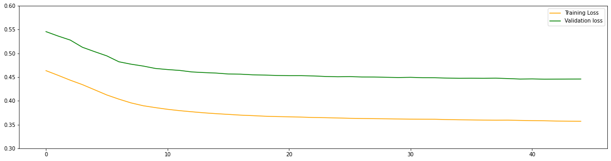
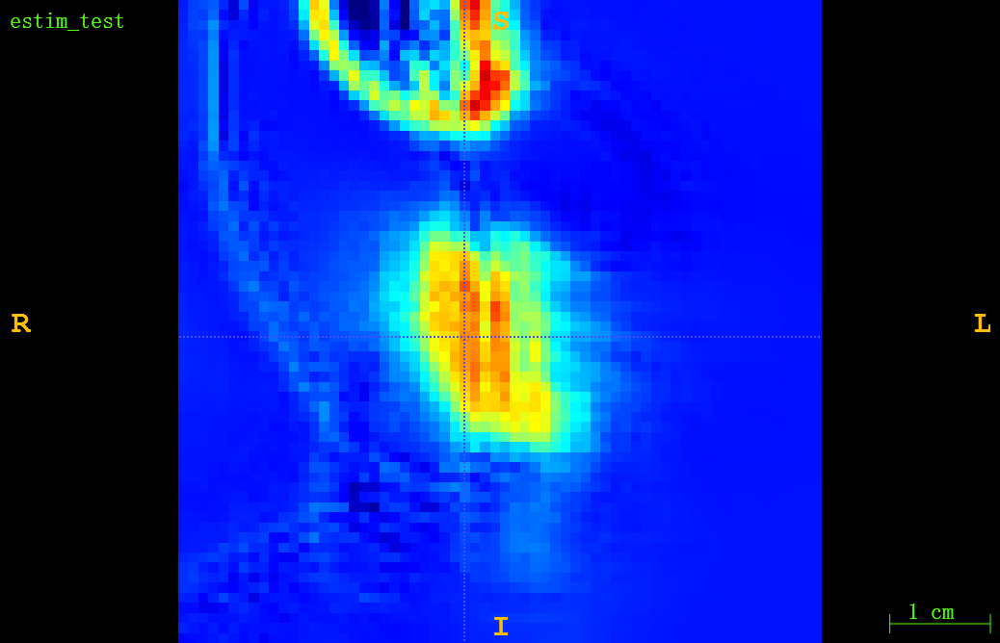

# Project-UCL-ZHENYA_YAN

It is the project in 2021-2022, University College London.

​
# Introduction

This is the project for positron annihilation and CNN training.
​

## **Folder**:

  **Code**:

    - CNN: 3D CNN based on 3D-Unet
    - Density_Image: Generate the random density map (Converted to MuMap)
    - LoadImage: Convert .txt file to .bin file
    - LoadMuMap: Convert .img file to .bin file
    - Voxelised: Monte Carlo Simulation macro files in GATE (Linux)
  
  **Output**:

    - Annihil (CNN output): The annihilation of Rb82. (.txt/.bin)
      

      - bin (20s) : 1kqe, 20s
      - bin : 1kqe, 1s // bin (20s) / 20
      - txt : 1kqe, 20s
    
    - Density:  Generated by "Density_Image" (Converted to MuMap)
     
      - bin: The density map (.bin) 
      - header: The header file to read the .bin (.h33)
      
    - Map:
    
      GATE output (.img): 1. Souce map (emission) 2. MuMap  
      - Mu: MuMap, converted from Density Map
      - source: Emission Map
      
      - Water-Lung-Box: Two Material model: 1kqe with 1/10/20 s
      - Loss: Loss function based on MSE.

# CNN

## **Loss** :  MSE

## **MuMap, Annihilation, Prediction** 

## (29,35,31)

